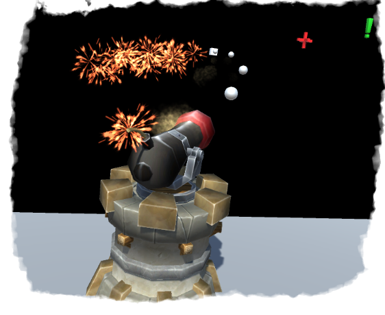

<h1 align="center">
Project Kinetics
</h1>

<h5 align="center">
A simple implementation of an automated targeting system
</h5>

    

-------------------

## About this repository
This repository is a project I created to implement an automated targeting system that can be used for stuff like turrets in games, I guess.
  This system can:
- Slowly aim at its target
- Calculate the aim point needed to hit a moving target (without considering projectile gravity)
- Calculate the aim point to hit a stationary target (taking projectile gravity into account)
 
 
  Additionally, the project includes a control panel to adjust various settings of the testing stand.

-------------------
## Demo

    

